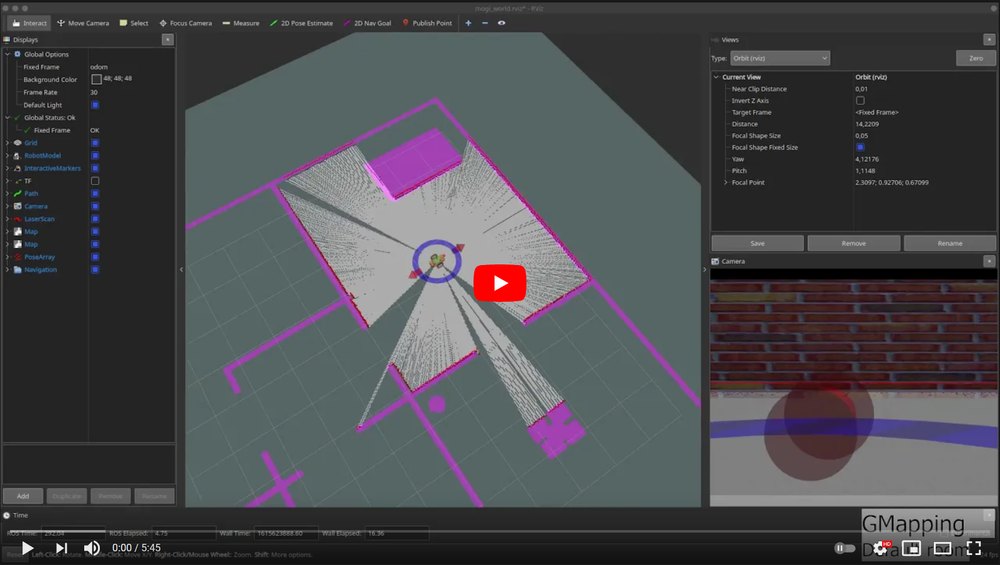
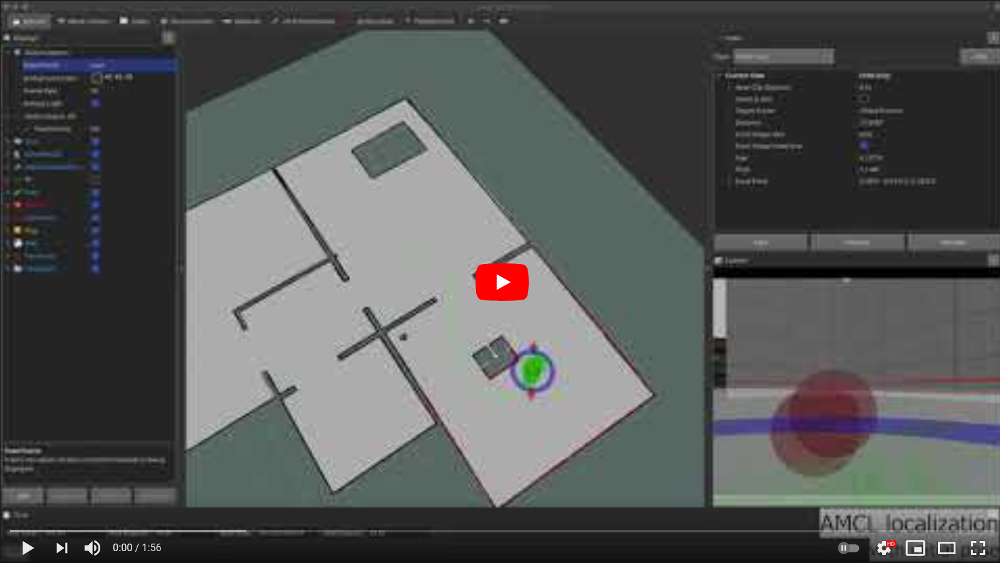

[//]: # (Image References)

[image1]: ./assets/mogi_bot_camera_1.png "Camera"
[image2]: ./assets/mogi_bot_camera_2.png "Camera"
[image3]: ./assets/mogi_bot_camera_3.png "Camera"
[image4]: ./assets/mogi_bot_camera_4.png "Camera"

# 7. - 8. hét - ROS navigáció

# Hova fogunk eljutni?

<a href="https://youtu.be/8bnjzPTNLfc"></a>
<a href="https://youtu.be/-YCcQZmKJtY"></a>

# Tartalomjegyzék
1. [Kezdőcsomag](#Kezdőcsomag)  
2. [Szenzorok 1](#Szenzorok-1)  
2.1. [Kamera](#Kamera)  
2.2. [IMU](#IMU)  
2.3. [GPS](#GPS)
3. [GPS waypoint követés](#GPS-waypoint-követés)
4. [Szenzorok 2](#Szenzorok-2)  
4.1. [Lidar](#Lidar)  
4.2. [Velodyne VLP16 lidar](#Velodyne-VLP16-lidar)  
4.3. [RGBD kamera](#RGBD-kamera)
5. [Képfeldolgozás ROS-ban OpenCV-vel](#Képfeldolgozás-ROS-ban-OpenCV-vel)

# Kezdőcsomag
A lecke kezdőcsomagja épít az előző fejezetekre, de egy külön GIT repositoryból dolgozunk, így nem feltétele az előző csomagok megléte.

A kiindulási projekt tartalmazza a Gazebo világ szimulációját, az alap differenciálhajtású MOGI robotunk modelljét és szimulációját, a kamera, IMU és Lidar szimulációját, valamint az alap launchfájlokat és RViz fájlokat.

A kezdőprojekt letöltése:
```console
git clone -b starter-branch https://github.com/MOGI-ROS/Week-7-8-Navigation.git
```

A kezdőprojekt tartalma a következő:
```console
david@DavidsLenovoX1:~/bme_catkin_ws/src/Week-7-8-Navigation/bme_ros_navigation$ tree
.
├── CMakeLists.txt
├── launch
│   ├── check_urdf.launch
│   ├── spawn_robot.launch
│   ├── teleop.launch
│   └── world.launch
├── meshes
│   ├── lidar.dae
│   ├── mogi_bot.dae
│   ├── vlp16.dae
│   └── wheel.dae
├── package.xml
├── rviz
│   ├── check_urdf.rviz
│   └── mogi_world.rviz
├── urdf
│   ├── materials.xacro
│   ├── mogi_bot.gazebo
│   └── mogi_bot.xacro
└── worlds
    └── world_modified.world
```

# Ground truth térkép készítése


world_map_creation.world

<plugin filename="libcollision_map_creator.so" name="collision_map_creator"/>

gzserver src/Week-7-8-Navigation/bme_ros_navigation/worlds/world_map_creation.world

roslaunch pgm_map_creator request_publisher.launch

A request publisher:
```xml
<?xml version="1.0" ?>
<launch>
  <arg name="map_name" default="map" />
  <arg name="save_folder" default="$(find pgm_map_creator)/maps" />
  <arg name="xmin" default="-15" />
  <arg name="xmax" default="15" />
  <arg name="ymin" default="-15" />
  <arg name="ymax" default="15" />
  <arg name="scan_height" default="5" />
  <arg name="resolution" default="0.05" />

  <node pkg="pgm_map_creator" type="request_publisher" name="request_publisher" output="screen" args="'($(arg xmin),$(arg ymax))($(arg xmax),$(arg ymax))($(arg xmax),$(arg ymin))($(arg xmin),$(arg ymin))' $(arg scan_height) $(arg resolution) $(arg save_folder)/$(arg map_name)">
  </node>
</launch>
```

 roslaunch bme_ros_navigation world.launch world_file:='$(find bme_ros_navigation)/worlds/20m_corridor_empty.world'

 roslaunch bme_ros_navigation spawn_robot.launch world:='$(find bme_ros_navigation)/worlds/20m_corridor_empty.world' x:=-7 y:=2 

# IMU Odometria szenzorfúzió
ToDo

# Hector SLAM
roslaunch bme_ros_navigation spawn_robot.launch
roslaunch bme_ros_navigation hector_slam.launch

## Corridor
roslaunch bme_ros_navigation spawn_robot.launch world:='$(find bme_ros_navigation)/worlds/20m_corridor_empty.world' x:=-7 y:=2 
roslaunch bme_ros_navigation hector_slam.launch map_file:='$(find bme_ros_navigation)/maps/corridor_hector.yaml'

## Corridor with features
roslaunch bme_ros_navigation spawn_robot.launch world:='$(find bme_ros_navigation)/worlds/20m_corridor_features.world' x:=-7 y:=2

# GMapping
roslaunch bme_ros_navigation spawn_robot.launch
roslaunch bme_ros_navigation gmapping.launch

# Corridor
roslaunch bme_ros_navigation spawn_robot.launch world:='$(find bme_ros_navigation)/worlds/20m_corridor_empty.world' x:=-7 y:=2
roslaunch bme_ros_navigation gmapping.launch map_file:='$(find bme_ros_navigation)/maps/corridor.yaml'

# Corridor with features
roslaunch bme_ros_navigation spawn_robot.launch world:='$(find bme_ros_navigation)/worlds/20m_corridor_features.world' x:=-7 y:=2

# Save map

rosrun map_server map_saver -f map

```console
david@DavidsLenovoX1:~/bme_catkin_ws/src/Week-7-8-Navigation/bme_ros_navigation/maps/saved_maps$ rosrun map_server map_saver -f map
[ INFO] [1614518022.653341900]: Waiting for the map
[ INFO] [1614518022.875830700, 563.990000000]: Received a 800 X 800 map @ 0.025 m/pix
[ INFO] [1614518022.875936200, 563.990000000]: Writing map occupancy data to map.pgm
[ INFO] [1614518022.933453800, 564.011000000]: Writing map occupancy data to map.yaml
[ INFO] [1614518022.933801100, 564.011000000]: Done

david@DavidsLenovoX1:~/bme_catkin_ws/src/Week-7-8-Navigation/bme_ros_navigation/maps/saved_maps$ ls
map.pgm  map.yaml
```


# AMCL
roslaunch bme_ros_navigation spawn_robot.launch

roslaunch bme_ros_navigation amcl.launch map_file:='$(find bme_ros_navigation)/maps/map.yaml'

roslaunch bme_ros_navigation amcl.launch

roslaunch bme_ros_navigation spawn_robot.launch world:='$(find bme_ros_navigation)/worlds/20m_corridor_features.world' x:=-7 y:=2

roslaunch bme_ros_navigation amcl.launch map_file:='$(find bme_ros_navigation)/maps/saved_maps/corridor.yaml'

# Navigation
roslaunch bme_ros_navigation spawn_robot.launch
roslaunch bme_ros_navigation navigation.launch

Costmap-ek törlése kézzel:
rosservice call /move_base/clear_costmaps "{}"

roslaunch bme_ros_navigation spawn_robot.launch world:='$(find bme_ros_navigation)/worlds/20m_corridor_features.world' x:=-7 y:=2
roslaunch bme_ros_navigation navigation.launch map_file:='$(find bme_ros_navigation)/maps/saved_maps/corridor.yaml'

## Recovery
ToDo

# Waypoint navigation

https://github.com/bergercookie/follow_waypoints

rosservice call /path_ready {}

## Patrol mode

# Waypoint navigation C++ code

## RViz visual markers

---

# Twist mux

# Velocity smoother

# Exploration